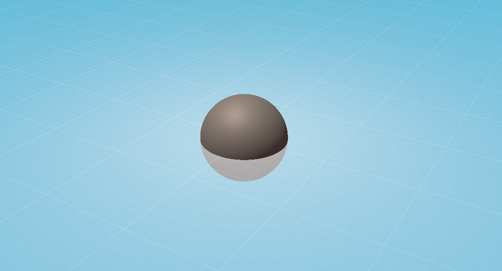
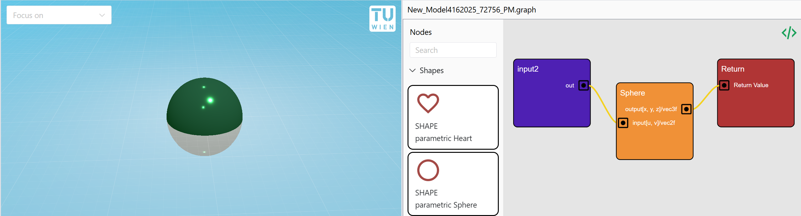

# Math2Model: Web-Based Real-Time Parametric Modeling Tool

Welcome to [Math2Model](https://cg-tuwien.github.io/Math2Model/), an online editor for parametric modeling of objects described through mathematical functions. It features two ways of user input: Code-based modeling and node-based modeling.

## What is Math2Model?

Math2Model is a tool that allows the instant rendering of mathematical functions given in parametric form (with parameters `u` and `v` as input). One simple example would be rendering a sphere model in parametric format:

```wgsl
fn sampleObject(input: vec2f) -> vec3f {
    let parameters = vec2(input.x, 2.0 * input.y) * 3.14159265359;
    let x = sin(parameters[0]) * cos(parameters[1]);
    let y = sin(parameters[0]) * sin(parameters[1]);
    let z = cos(parameters[0]);
    return vec3(x, y, z);
}
```

_Listing 1:_ Code for describing a sphere model in our code editor.

The code from Listing 1 produces the output shown in Figure 1.

     
_Figure 1:_ Parametrically described sphere, rendered with Math2Model.

## Who is Math2Model for?

Math2Model is a tool for everyone who wants to render mathematical functions in real time or create parametric models with feedback in real time. It features two user interfaces: one for programmers, where they can directly describe mathematical objects in source code (see Figure 2), and another for non-programmers, which allows parametric modeling through a node editor (see Figure 3).

      
_Figure 2:_ Image of Math2Model's code editor for describing parametric objects in [WGSL](https://www.w3.org/TR/WGSL/) source code.

     
_Figure 3:_ Image of Math2Model's node editor for describing parametric objects through graphical modeling.

## How does it work?

Math2Model implements a version of the rendering technique presented in [Fast Rendering of Parametric Objects on Modern GPUs](https://www.cg.tuwien.ac.at/research/publications/2024/unterguggenberger-2024-fropo/), adapted to a web implementation using the [WebGPU](https://www.w3.org/TR/webgpu/) graphics API.

It uses a level-of-detail (LOD) stage to create enough geometric detail. It renders sufficiently subdivided patches of input parameters in order to achieve close to pixel-perfect geometric precision.

## Contributing

Read our [CONTRIBUTING.md](./CONTRIBUTING.md)

## Project Setup

This project depends on Node.js with npm and Rust. 

1. Install Node.js and Rust
2. `npm install` in the main folder
3. `cd parametric-renderer-core` and `npm install`

Now the dependencies have been installed.

To run it
1. `npm run dev` to start up the web server
2. `cd parametric-renderer-core` and `npm run build` in a separate terminal to build the WASM package.
3. `npm run docs:dev` to run the documentation page

As for everything else, check out our [CONTRIBUTING.md](./CONTRIBUTING.md)
