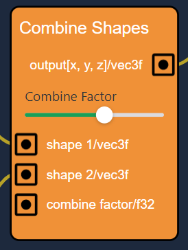
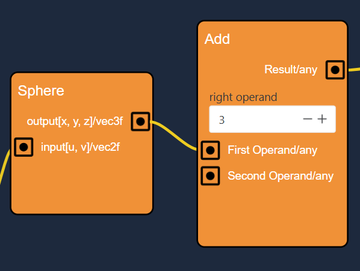
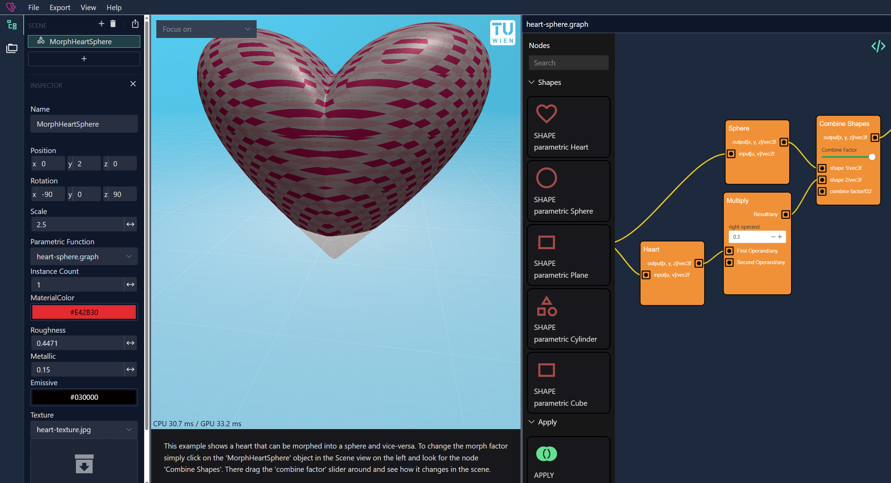

# Graph Based Shapes

This purely graphical shader programming solution has been designed to provide easier access to parametric modelling for people who are not that proficient with programming. Creating a new model and selecting the `New Graph` option will create a `<filename>.graph` and a `<filename>.graph.wgsl` file. The `.wgsl` file is automatically generated from the code graph and always updated when changes occur.

## General Usage

The flow of code graphs is designed to be rather easy. Creating a new code graph will greet you with the necessary nodes to render a sphere. These two nodes, that every code graph has, are essential to actually parametically define your shape:

- **input2**: this is the parameter to the `evaluateImage` function. It contains the vertex coordinates of the basic plane `[u, v]`.
- **Return**: this is always the last line in the `evaluateImage` function and will return whatever value comes from the connected node. It is important to note, that the `Return` node requires a `vec3f` as an input value, so for example just connecting the `input2` node would not work.

There are two important user-controlled parts to every code graph, which will be described in detail now:

### Nodes

These blocks (both visually and practically) contain user-controlled data (i.e. numerical values, input connections) and internal functionality to determine the line of code to generate. Only the first part is relevant for using the code graph, so we will focus on that.



In the image above you can see a simple node of the graph. Let's go over the data from top to bottom. Every node has a title, which is written right on top, in this case a `Combine Shapes` node. Then it is followed by the output(s) of the node on the right side. Next to the output(s) the output value is described with a name and the value type to be returned seperated by a '/'. The different value types in the code graph are limited to:

- _f32_: a floating point number
- _vec2f_: a 2-dimensional vector of floating point numbers
- _vec3f_: a 3-dimensional vector
- _vec4f_: a 4-dimensional vector
- _any_: the type depends on the input of the node and is either one of the above
- _same_: the type is the same as the input type

Next there are the manual input fields, in this case the `combine factor`. These are fields that are defined by the user and can be changed whenever. Differently from the input slots, which will be discussed in the next session, these fields typically don't take values from other nodes.

Lastly most nodes have input slots as well. These are listed on the left side and always at the bottom of a node. Just like the outputs, the input slots have labels that work the same way. These input slots have default values (which are not shown) and accept output values from other nodes, which will replace the default value. In this case we have `shape 1`, a 3-dimensional vector input, `shape 2`, another 3-dimensional vector input and `combine factor` as an alternative input method for the manual `combine factor`.

### Connections

You may have noticed these yellow lines going from node to node throughout a code graph. These are called `Connections` and allows the nodes to transfer data between each other. The flow is always the same, one output from node A goes into the input of node B, so node B can access the output value from node A, but not vice versa.



Let's focus on the example example image above and specifically on the connection between the node `Sphere` and `Add`. Looking at the input slots of `Add` first reveals that it accepts two inputs of any type as described above. The `Sphere` node has an output of the type `vec3f` which is a valid type for the input slot for "First Operand" of the `Add` node. The other input "Second Operand" is given manually in the number field and set to _3_. Alternatively the "Second Operand" could also be a connection between one node (it could even be the same node as the one for "First Operand") and this `Add` node.
Now if the `Sphere` node changed in any way, the `Add` node would immediately receive the new output data and therefore generate a different output data as well.

## Code Graph Overview - Heart-Sphere example

When opening the "Math2Model" Web application for the first time you will be greeted with a simple scene rendering a heart. This heart represents the "MorphHeartSphere" model in the Scene Hierarchy on the left side. Clicking on the model in the Scene Hierarchy will open the code graph of the model on the right side.



After clicking on the model the application will look similar to the figure above. In the code graph you can:

- Drag the view around by holding the left mouse button and dragging the mouse
- Zoom in and out with the scroll wheel
- Select nodes by left clicking them
- Select multiple nodes by holding CTRL while left clicking them
- Open a context menu with various options by pressing the right mouse button
- Create new nodes by dragging them from the nodes list on the left side into the graph

You can always view the generated code file by pressing on the icon on the top-right corner of the code graph.

Let's go through the code graph of the Heart Sphere Morph Example. Like in every code graph, it starts with the `input2` node, which represents the input coordinates of the plane that is parametrically shaped. This initial node is connected to the `Heart` and `Sphere` node, which both can be found under the `Shapes` category in the nodes list. Defining a base shape for your parametric object is common for code graphs, the output of the `input2` node is dragged onto the input of the `Heart` and `Sphere` node. The generated code should look something like this (see also under `heart-sphere.graph.wgsl`).

```ts
var ref_831ed = Sphere(input2); // this creates a vec3f reference to the value of Sphere(input2)
var ref_fd7fa = Heart(input2); // this creates a vec3f reference to the value of Heart(input2)
```

The `Shapes` nodes - just like `Heart` or `Sphere` - typically transform a two-dimensional input into a three-dimensional output and can be straight up used as the `Return value` on the `Return` node, which is always marked red.

In this example though the values get transformed a little bit further. The `Heart` output gets multiplied with `0.3` to scale it down a bit using a `Multiply` node. (`Note: The search function in the nodes list can come in handy, if you have trouble finding the correct node.`). This node comes with two input fields and two input connection points, so users can either provide values by hand or use generated values from other nodes. In this example the left operand uses the generated value from the `Heart` node and the right operand is given by hand. Lastly both the transformed `Heart` output and the `Sphere` output are put into a `Combine` node. This uses the shader's mix function to interpolate between the first input shape and the second input shape. Drag the `combine factor` slider to see the effects.

To let the application actually render the resulting shape you always need to connect the final output with the `Return` node.
