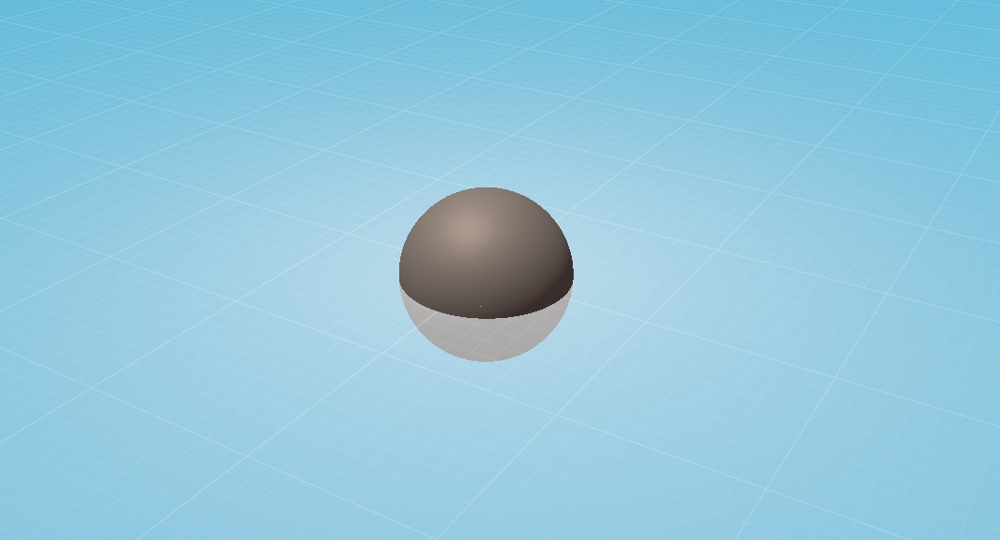
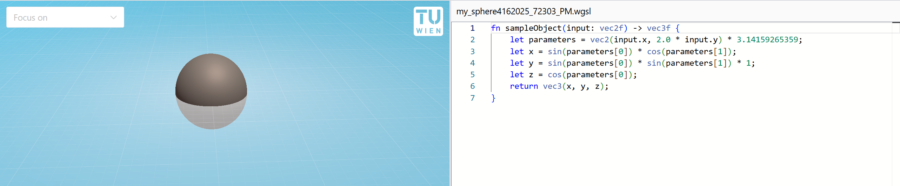
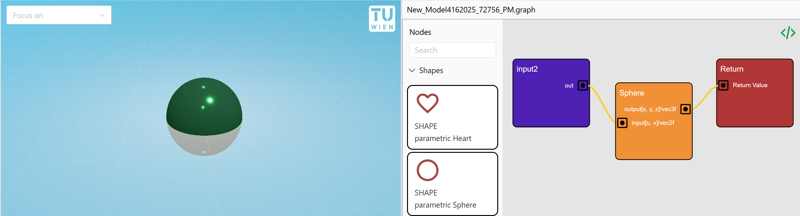

<script setup>
import { ImgComparisonSlider } from '@img-comparison-slider/vue';
</script>

<style>
  .before,
  .after {
    margin: 0;
  }

  .before figcaption,
  .after figcaption {
    background: #fff;
    border: 1px solid #c0c0c0;
    border-radius: 12px;
    color: #2e3452;
    opacity: 0.8;
    padding: 12px;
    position: absolute;
    top: 50%;
    transform: translateY(-50%);
    line-height: 100%;
  }

  .before figcaption {
    left: 12px;
  }

  .after figcaption {
    right: 12px;
  }
</style>

# Documentation for Math2Model

Math2Model is a tool for creating scenes with parametrically defined 3D objects.
It offers two modeling modes: Code-based and node-based modeling.

The modeled objects can be exported into 3D mesh file formats.

<ImgComparisonSlider hover="hover">
<figure slot="first" class="before">
    
    <figcaption>Light Mode</figcaption>
  </figure>
  <figure slot="second" class="after">
    
    <figcaption>Dark Mode</figcaption>
  </figure>
</ImgComparisonSlider>

## What is Math2Model?

It is a tool that allows the instant rendering of mathematical functions given in parametric form (with two parameters as input). One simple example would be rendering a sphere model in parametric format:

```js
fn sampleObject(input: vec2f) -> vec3f {
    let parameters = vec2(input.x, 2.0 * input.y) * 3.14159265359;
    let x = sin(parameters[0]) * cos(parameters[1]);
    let y = sin(parameters[0]) * sin(parameters[1]);
    let z = cos(parameters[0]);
    return vec3(x, y, z);
}
```

This code produces the following output:



## Who is Math2Model for?

Math2Model is a tool for anyone who wants to render mathematical functions in real time or create parametric models with feedback in real time. It features two user interfaces: One for programmers, where they can directly describe those mathematical objects in source code, and another user interface for non-programmers, which allows parametric modelling through a node editor.


_Sphere example in code editor_


_Sphere example in code graph_

## How does it work?

To start a new project, go to [math2model.cg.tuwien.ac.at](https://math2model.cg.tuwien.ac.at/) and create a new project via File -> New. Then create a new parametric object by using the `+` button, and choose whether to model it through code or through the node editor (see images above).

## UI Overview

The Math2Model user interface (UI) supports a set of features that are described on the [UI Overview](./ui-overview.md) page.

## Graph-based objects

3D objects can be modeled using a visual, node-based editor that is described on the [Graph-based shapes](./graph-based-shapes.md) page.

## Programmatic objects

An alternative way to model 3D objects is through code.
This approach allows for more freedom and flexibility than node-based modeling, and allows the creation of shapes that are difficult to express in the graph-based approach.
However, this approach requires coding or scripting skills---preferably with a shader programming language. 

More details are described on the [Programmatic shapes](./programmatic-shapes.md) page.

## Exporting scenes

Parametrically modeled objects can be exported to 3D file formats for further usage.
This is described on the [Exporter](./exporter.md) page.
