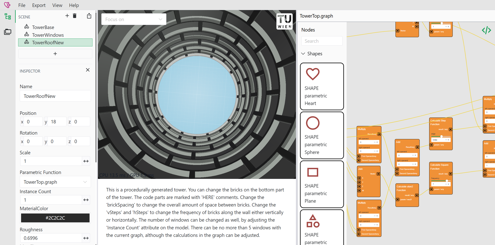
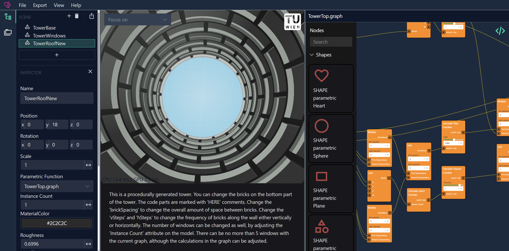

# Documentation for Math2Model

Math2Model is a tool for creating scenes with parametrically defined 3D objects.

It offers two main modes, targeted at different audiences.

At the end, the objects can be exported into a standard 3D mesh file format.

<ImgComparisonSlider hover="hover">
<figure slot="first" class="before">
    
    <figcaption>Light Mode</figcaption>
  </figure>
  <figure slot="second" class="after">
    
    <figcaption>Dark Mode</figcaption>
  </figure>
</ImgComparisonSlider>

## UI Overview

The Math2Model UI supports a lot of features. We recommend reading the documentation!

[Read more](./ui-overview.md)

## Graph based objects

Build your 3D objects using a visual, node-based editor. 
This is the recommended approach for rapid prototyping.

[Read more](./graph-based-shapes.md)

## Programmatic objects

Build your 3D objects using code.
This lower level approach is useful for expressing things 
that are difficult to express in the graph based approach.
It assumes basic GPU shader programming knowledge.

[Read more](./programmatic-shapes.md)

## Exporting scenes

Export your 3D objects to commonly used mesh based 3D file formats for further usage.
[Read more](./exporter.md)

