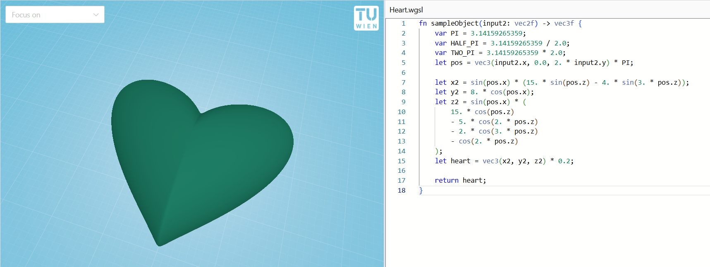
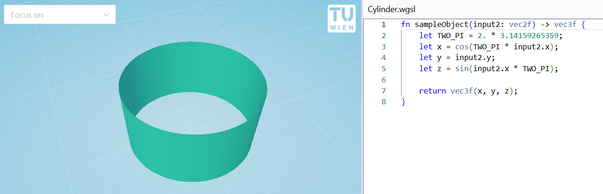
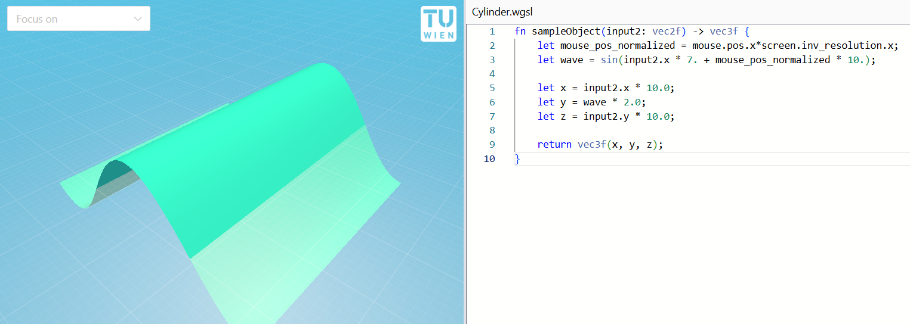
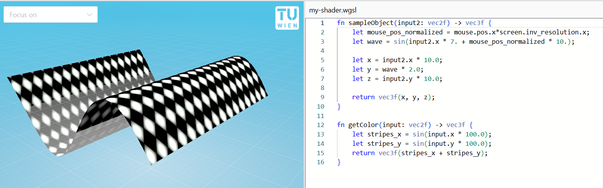

# Programmatic Shapes

Math2Model allows you to write [WGSL shaders](https://google.github.io/tour-of-wgsl/) to create 3D models.

We recommend familarizing yourself with the WGSL shader syntax before continuing. Tutorials that we recommend are

- [WebGPU Fundamentals' chapter on WGSL](https://webgpufundamentals.org/webgpu/lessons/webgpu-wgsl.html)
- [Tour of WGSL](https://google.github.io/tour-of-wgsl)



## Defining a shape

Our shaders have an entrypoint `fn sampleObject(input2: vec2f) -> vec3f`. This function repeatedly get evaluated to get all 3D coordinates for the mesh. The input coordinates are in the unit square (0 to 1 range).

For example, a plane in 3D can be defined as

```wgsl
fn sampleObject(input2: vec2f) -> vec3f {
    let x = input2.x;
    let y = input2.y;
    let z = 0.;

	return vec3f(x, y, z);
}
```

Objects can be resized by multiplying their coordinates
```wgsl
fn sampleObject(input2: vec2f) -> vec3f {
    let x = input2.x * 10.0;
    let y = input2.y * 10.0;
    let z = 0. * 10.0;

	return vec3f(x, y, z);
}
```

Or flipped, by swapping coordinates!
```wgsl
fn sampleObject(input2: vec2f) -> vec3f {
    let x = input2.x * 10.0;
    let y = 1. * 10.0; // Slightly elevated
    let z = input2.y * 10.0;

	return vec3f(x, y, z);
}
```


An open cylinder can be creating by bending a plane. So it can be defined as

```wgsl
fn sampleObject(input2: vec2f) -> vec3f {
    let TWO_PI = 2. * 3.14159265359;
    let x = cos(TWO_PI * input2.x);
    let y = input2.y;
    let z = sin(input2.x * TWO_PI);

    return vec3f(x, y, z);
}
```



## Globals

### Time

- `time.elapsed` (f32) - number of seconds since program start
- `time.delta` (f32) - number of seconds that the last frame took, usually 60 / 1000
- `time.frame` (u32) - frame index

Example: Waving plane

```wgsl
fn sampleObject(input2: vec2f) -> vec3f {
    let wave = sin(input2.x * 7. + time.elapsed);

    let x = input2.x * 10.0;
    let y = wave * 2.0; // Don't scale the waves as much
    let z = input2.y * 10.0;

	return vec3f(x, y, z);
}
```

### Screen

- `screen.resolution` (vec2&lt;u32&gt;) - size of the screen in pixels
- `screen.inv_resolution` (vec2f) - convenience accessor for `1./screen.resolution`

### Mouse

- `mouse.pos` (vec2f) - current position of the mouse on the screen
- `mouse.buttons` (u32) - 1 if a mouse button is held, 0 otherwise

Example: Animate the wave when move when moving the mouse across the screen
```wgsl
fn sampleObject(input2: vec2f) -> vec3f {
    let mouse_pos_normalized = mouse.pos.x*screen.inv_resolution.x;
    let wave = sin(input2.x * 7. + mouse_pos_normalized * 10.);

    let x = input2.x * 10.0;
    let y = wave * 2.0;
    let z = input2.y * 10.0;

	return vec3f(x, y, z);
}
```



## Coloring a shape

Finally, shapes can be colored! The UI exposes typical PBR material settings, and allows you to apply textures. [See UI tutorial for more](./ui-overview.md).

However, it is also possible to write a shader function to color in a shape. To do so, simply add a function with the signature `fn getColor(input: vec2f) -> vec3f` to your shader.

::: warning
The signature must match exactly. This includes the name of the `input` parameter.
This is due to a technical limitation in our implementation. To address this, and other rough edges, we started the [WESL](https://wesl-lang.dev/) project. 
:::

The coloring function will then be used as the "color" input into a PBR (physically based rendering) material. It will be combined with the roughness, metallic and emissive values.

To output a single, fixed color, one simply returns that color.
Do note that it follows the floating point RGB convention, where the color values are in the 0-1 range.
```wgsl
fn getColor(input: vec2f) -> vec3f {
  return vec3f(1.0, 0.0, 0.0);
}
```

To get more interesting patterns, one uses the input coordinates. These are the same input coordinates that the `sampleObject` function receives. Here, we are using the `sin` function to get repeating stripes. The `sin` function repeatedly goes to high values (light) and then to low values (dark).

```wgsl
fn getColor(input: vec2f) -> vec3f {
    let stripes_x = sin(input.x * 100.0);
    let thin_stripes_x = smoothstep(0.6, 1.0, stripes_x);
    return vec3f(thin_stripes_x);
}
```

Such stripes can be combined to create grids.
```wgsl
fn getColor(input: vec2f) -> vec3f {
    let stripes_x = sin(input.x * 100.0);
    let thin_stripes_x = smoothstep(0.6, 1.0, stripes_x);
    let stripes_y = sin(input.y * 100.0);
    let thin_stripes_y = smoothstep(0.6, 1.0, stripes_y);
    return vec3f(max(thin_stripes_x, thin_stripes_y));
}
```

Or one can be creative, and even create a rotated checkerboard pattern!
```wgsl
fn getColor(input: vec2f) -> vec3f {
    let stripes_x = sin(input.x * 100.0);
    let stripes_y = sin(input.y * 100.0);
    return vec3f(stripes_x + stripes_y);
}
```



### Globals for coloring

When writing custom coloring routines, it is rare to use any of the built-in globals.
The most common ones can be seen below in the "default coloring function".


For completeness, all usable globals are as follows

- `material.color_roughness` (vec4f) - the .xyz components are the color, the 4th component is the automatically applied PBR roughness value
- `material.emissive_metallic` (vec4f) - the .xyz components are the automatically applied emissive color, the 4th component is the automatically applied PBR metallic value
- `material.has_texture` (u32) - 1 if there is a texture, otherwise 0
- `material.texture_scale` (vec2f) - user supplied scaling of the texture

- `t_diffuse` (texture2d&lt;f32&gt;) - user supplied texture
- `linear_sampler` (sampler) - a linear sampler that wraps around

### Default coloring function


The default function for coloring in a shape applies a texture if one is present.
Otherwise it falls back to the color.

```wgsl
fn getColor(input: vec2f) -> vec3f {
  if material.has_texture != 0u {
    return textureSample(t_diffuse, linear_sampler, input * material.texture_scale).rgb;
  } else {
    return material.color_roughness.rgb;
  }
}
```