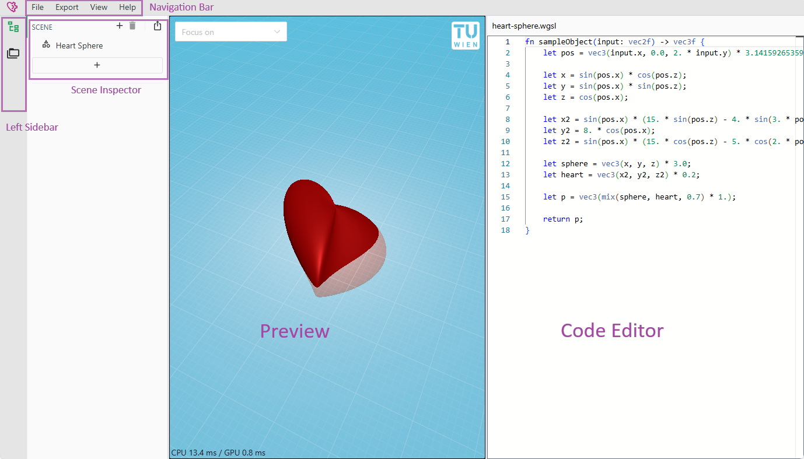
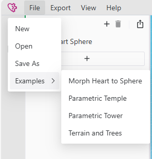
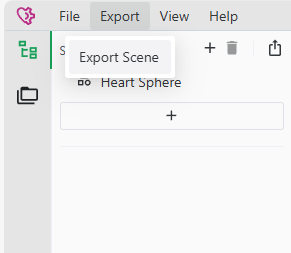
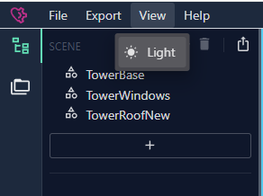
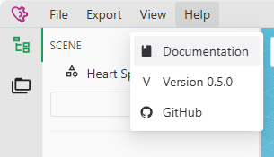
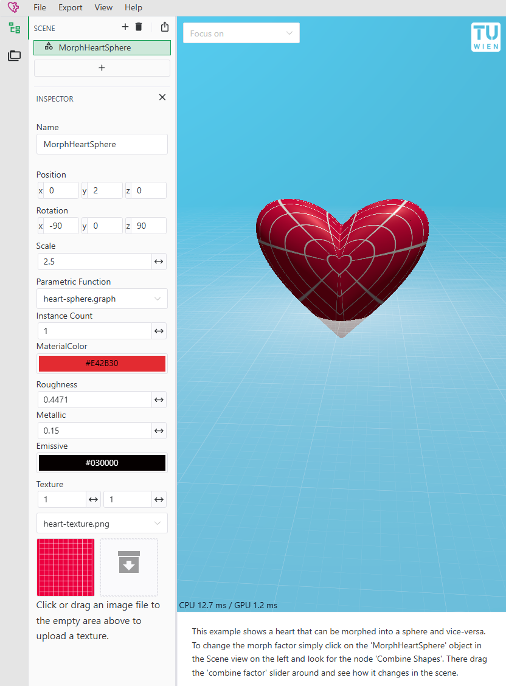
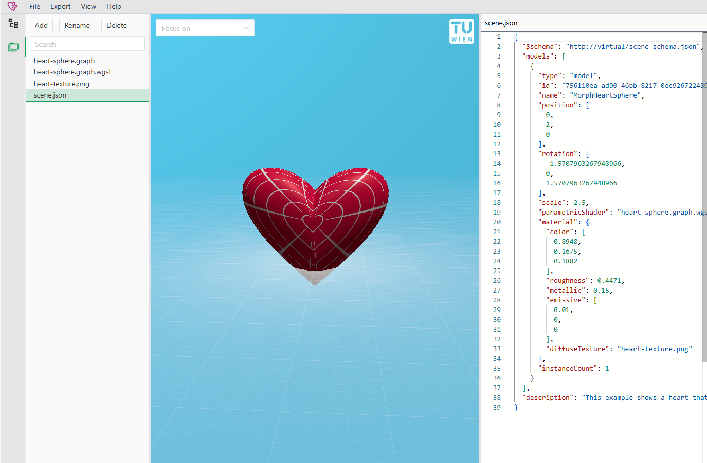
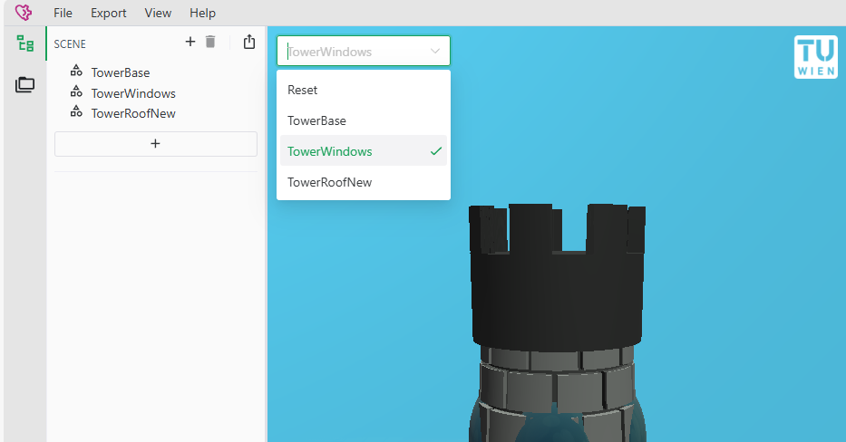

# UI Overview

This document provides a detailed overview of the User Interface (UI) for the application, describing its main components, navigation, and functionalities. 

## Navigation Bar

The navigation bar, located at the top of the UI, provides access to essential file operations, exporting options, theme settings, and help resources.

### File Menu
The File menu allows you to:
- **Create new projects** from scratch.
- **Load** a previously saved project, and **save** your current project.
- **Load examples** to quickly explore templates and demos.

::: tip
Your current project is always automatically saved, so you never have to worry about losing data.
:::

### Export Menu
The Export menu provides options to:
- **Export** your scene or models to common 3D file formats (`.gltf` and `.obj`).
- For more details about the exporting process and options, refer to the [Exporter Documentation](./exporter.md).

### Dark Mode Toggle
- The UI includes a **Dark Mode** toggle for better visibility in low-light environments.
- By default, it follows your **system theme**.
- The application **remembers** your last selected theme across sessions.

### Help Menu
The Help menu provides quick access to:
- The **documentation** you are currently reading.
- The **current application version**.
- A link to the **GitHub repository** where you can **report bugs** or **request features**.

## Left Sidebar

The left sidebar has two primary panels: the **Scene Inspector** and the **File Browser**.

You will mostly use the **Scene Inspector**. The **File Browser** is for lower level control, such as manually editing the `scene.json`.

### Scene Inspector

The Scene Inspector allows you to manage and manipulate the objects in your scene:
- **View** all objects in the scene.
- **Add** new objects with the plus (+) button.
- **Delete** existing objects with the trash bin (🗑️)
- **Select** multiple objects for simultaneous editing:
  - Use **Ctrl** for individual multiple selection.
  - Use **Shift** for range selection (similar to most desktop applications).

#### Editing Objects
Once an object is selected, you can modify its properties:

- **Position**: Move the object within the 3D space.
- **Rotation**: Rotate the object along different axes.
- **Scale**: Resize the object proportionally.
- **Parametric Function**: Choose the function that defines the object's geometry.
- **Instance Count**: Define how many instances (copies) of the object appear in the scene. The parametric function can use the instance count to draw each instance slightly differently!
- **Material (PBR - Physically Based Rendering)**:
  - **Roughness**: Adjust the surface texture from coarse to shiny.
  - **Metallic**: Set how metallic the object appears.
  - **Emissive**: Make the object emit light, affecting the scene lighting.
- **Texture Settings**:
  - **Size**: Set the scaling of the texture. The texture automatically repeats.
  - **Texture Selection**: Upload and apply textures from your **local filesystem**. _We take your privacy seriously; uploaded textures are never sent to any server._

### File Browser

The file browser shows you the current state of all files in your project.

The main file is the `scene.json` file, which defines the structure and content of your scene.

For each parametric function, there is
- A `.wgsl` file which contains the shader code. If it is a graph-based function, then this file is read-only.
- Optionally a `.graph` file which contains the shader graph.

- You can **directly edit** the `scene.json` file within the application.
- **Real-time updating**: Changes to the files are reflected instantly in the scene.
- **Autocomplete** in the `scene.json` is available based on a **JSON Schema** to assist and validate your edits.

## Output View

The Output View displays the final generated 3D model based on your scene.

- **Rendering Engine**: Uses an advanced, research-based renderer described in [this paper](https://doi.org/10.2312/pgv.20241129).
- **Technology**: Powered by the modern **WebGPU API**, ensuring high performance and future-proof rendering.
- **Browser Support**: Chrome and Edge are fully supported. Firefox support is expected later this year, pending feature updates.

**Features**:
- **Top-left corner**: Focus on a selected object to center and zoom in.

- **Bottom-left corner**: Real-time FPS counter.

## Code/Graph View

Located on the **right side** of the interface, the Code/Graph View provides two alternative methods for creating and editing shapes:

- **[Edit the Code](./programmatic-shapes.md)**: Directly modify the parametric or procedural code that defines the shape behavior and appearance.
- **[Edit the Graph](./graph-based-shapes.md)**: Use a visual graph-based editor to build complex shapes without writing code manually.

These two modes cater to the different workflows of both coders and designers.
